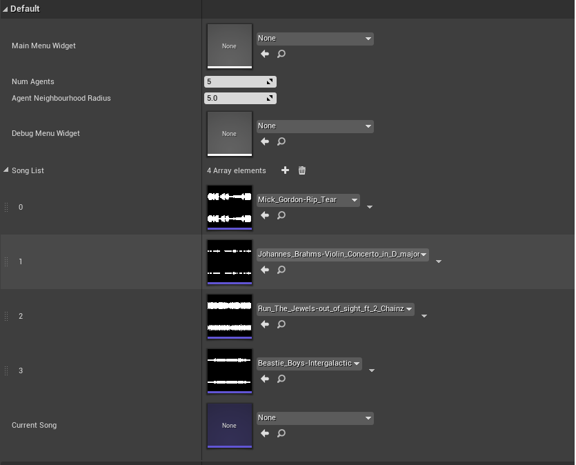

# MoshpitSim
This is a term project for CPSC 565 (Emergent Computing) completed at the University of Calgary.

You can read my full project write-up [here](Images/CPSC565_Paper.pdf)

## Instructions for downloading source code
1. Download or Clone Repo
2. Open Unreal Engine Project File

## Main Menu
Upon starting the simulation you will get to adjust some of the parameters of the simulation through the Main Menu.

### Settings

* **Num of Agents:** How many agents you wish to start the simulation with.
* **Agent Neighborhood Radius:** How big each agent's neighborhood is.
* **Select Song:** From this dropdown you can select the song that will play during the simulation. Songs can be added (see section below)
* **Aggression:** Affects how likely an agent is to start thrashing.
* **Music Feel:** Affects how much the music intensity affects the agent's state.
* **Group Think:** Affects how likely an agent's state change is affected by its neighbors.

## In-Game Debug Menu
During the simulation you can press the 'J' key to bring up the debug menu.

## Adding your own songs
1. Import a WAV file into the Unreal Engine Editor.
2. Double click on the sound file to bring up its settings.
3. Scroll down and make sure the "Enable Baked FFTAnalysis" box is checked.
4. Add your sound file to the "Song List" parameter on the Game Manager Blueprint (see picture below)
5. Your song should now show up in the drop down menu!

